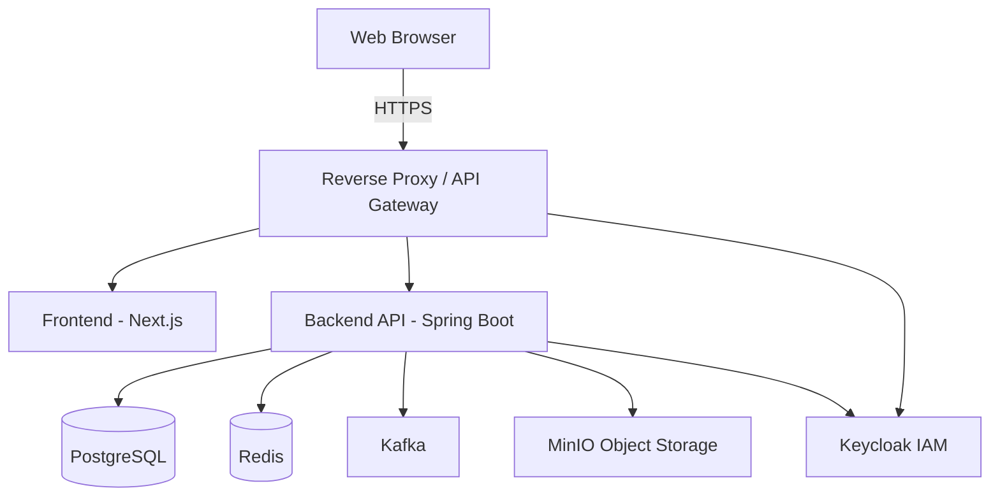

# Recruitment & Mobilization ERP

A comprehensive Enterprise Resource Planning solution for recruitment and mobilization, enabling end-to-end management of candidates, clients, and operational workflows.

## Architecture Overview



## Tech Stack

| Component | Technology |
|---|---|
| Frontend | Next.js (React), Node.js 20, TypeScript, TailwindCSS |
| Backend | Java 21, Spring Boot 3, Hibernate |
| Database | PostgreSQL |
| Caching | Redis |
| Messaging | Apache Kafka |
| Object Storage | MinIO |
| IAM / Auth | Keycloak |
| Local Email | Mailpit |
| CI/CD | GitHub Actions |

## Prerequisites

- Java 21
- Maven
- Docker & Docker Compose
- Node.js 20

## Quick Start

1. Clone the repository:
   ```bash
   git clone <repo-url>
   cd recruitment-erp
   ```
2. Copy the environment template:
   ```bash
   cp .env.example .env
   ```
3. Start the infrastructure services:
   ```bash
   docker-compose -f docker/docker-compose.yml up -d
   ```
4. Wait for all services to become healthy.
5. Build and run the backend:
   ```bash
   cd backend
   mvn clean install
   ```
6. Install dependencies and run the frontend:
   ```bash
   cd frontend
   npm install
   npm run dev
   ```
7. **Access Points:**
   - Frontend: http://localhost:3000
   - Swagger UI: http://localhost:8081/swagger-ui.html
   - Keycloak: http://localhost:8180
   - Kafka UI: http://localhost:8090
   - MinIO Console: http://localhost:9001
   - Mailpit: http://localhost:8025

## Test Users

| Role | Email | Password |
|---|---|---|
| Admin | admin@erp.local | admin123 |
| Recruiter | recruiter@erp.local | recruit123 |
| Client | client@erp.local | client123 |

## Development Workflow

- We follow standard GitFlow.
- Feature branches should be created from `develop`.
- Commits must follow Conventional Commits (enforced via pre-commit).
- CI runs on all PRs to `main` and `develop`.

## Project Structure

```
recruitment-erp/
├── .github/          # GitHub Actions workflows
├── backend/          # Spring Boot Java application
├── frontend/         # Next.js React application
├── docker/           # Docker Compose and configuration
├── docs/             # ADRs and documentation
└── README.md
```

## License

[License placeholder]
# Recruitment-ERP
